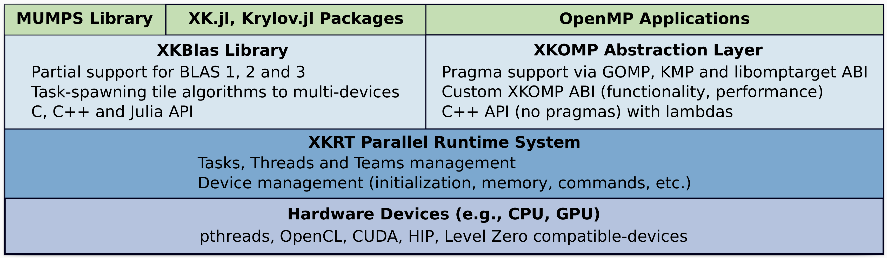

[](https://rpereira-dev.github.io/xkrt/)

# XKaapi Runtime (XKRT) - A parallel runtime system for macro-dataflow on multi-devices architectures.

XKRT is a macro-dataflow and tasking runtime system for automating memory management alongside parallel execution. It provides portable abstraction for C, C++, Julia and partial support for BLAS and OpenMP.

Please open any issue at https://github.com/rpereira-dev/xkrt

# Related Projects
This repository hosts the XKRT runtime system.    
Other repository hosts specialization layers built on top of the runtime:
- [XKBlas](https://gitlab.inria.fr/xkblas/dev/-/tree/v2.0) is a multi-gpu BLAS implementation that allows the tiling and composition of kernels, with asynchronous overlap of computation/transfers.
- [XKOMP](https://github.com/anlsys/xkomp) is an experimental OpenMP runtime built on top of XKRT.
- [XKBlas.jl](https://github.com/anlsys/XKBlas.jl) Julia bindings of XKBlas
- [XKBM](https://github.com/anlsys/xkbm) is a suite of benchmark for measuring multi-gpu architectures performances, to assist in the design of runtime systems.

[](docs/software-stack.pdf)

# Getting started

## Installation

XKRT is implemented in C++ and exposes two APIs: C and C++.

### Requirements
- A C/C++ compiler with support for C++20 (the only compiler tested is LLVM >=20.x)
- hwloc - https://github.com/open-mpi/hwloc

### Optional
- Cuda, HIP, Level Zero, SYCL, OpenCL
- CUBLAS, HIPBLAS, ONEAPI::MKL
- NVML, RSMI, Level Zero Sysman
- AML - https://github.com/anlsys/aml
- Cairo - https://github.com/msteinert/cairo - for debugging purposes, to visualize memory trees

### Build example
See the `CMakeLists.txt` file for all available options.

```bash
# with support for only the host driver and debug modes, typically for developing on local machines with no GPUs
CC=clang CXX=clang++ cmake -DUSE_STATS=on -DCMAKE_BUILD_TYPE=Debug ..

# with support for Cuda
CC=clang CXX=clang++ CMAKE_PREFIX_PATH=$CUDA_PATH:$CMAKE_PREFIX_PATH cmake -DUSE_CUDA=on ..

# with support for Cuda and all optimization
CC=clang CXX=clang++ CMAKE_PREFIX_PATH=$CUDA_PATH:$CMAKE_PREFIX_PATH cmake -DUSE_CUDA=on -DUSE_SHUT_UP=on -DENABLE_HEAVY_DEBUG=off -DCMAKE_BUILD_TYPE=Release ..
```

## Available environment variable
- `XKRT_HELP=1` - displays available environment variables.

# Directions for improvements / known issues
- There is currently 1x coherence controller per couple `(LD, sizeof(TYPE))` while there should be for `LD * sizeof(TYPE)` - which can be useful for in-place mixed-precision conversions
- Add a memory coherency controller for 'point' accesses, to retrieve original xkblas/kaapi behavior - that is a decentralized and tile-base coherence protocol
- Stuff from `xkrt-init` could be moved for lazier initializations
- Add support for blas compact symetric matrices
- Add support for GDRCopy in the Cuda Driver (https://developer.nvidia.com/gdrcopy) - for low overhead transfer using CPUs instead of GPUs DMAs
- Add support for commutative write, maybe with a priority-heap favoring accesses with different heuristics (the most successors, the most volume of data as successors, etc...)
- Add support for IA/ML devices
